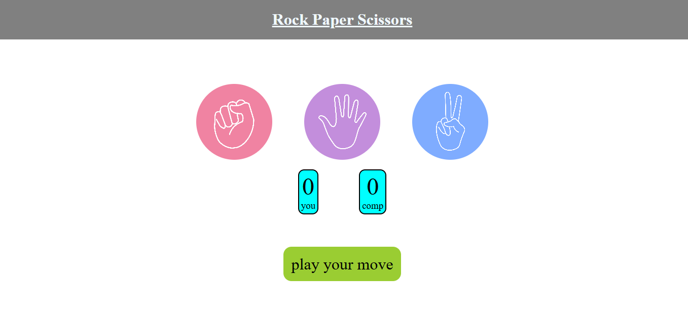

# ✊🖐✌ Stone Paper Scissors – A Classic JavaScript Game

A simple **Stone Paper Scissors** game where you play against the computer. Built with **HTML, CSS, and JavaScript**, this game offers an interactive experience with instant results.  

## 🚀 Features  
✅ Player vs Computer Mode  
✅ Randomized computer moves  
✅ Score tracking system  
✅ Responsive design for mobile & desktop  

## 📸 Screenshot  
  

## 🎮 How to Play?  
- Choose **Stone (✊), Paper (🖐), or Scissors (✌)**.  
- The computer will randomly pick a move.  
- The game will instantly show **who won!**  

  
🌐 Live Demo
Live Demo Here (https://stone-paper-scissors-a-classic.onrender.com)

🛠 Technologies Used
HTML – Game structure

CSS – Styling & animations

JavaScript – Game logic

📌 Project Structure
bash
Copy
Edit
stone-paper-scissors/
│── index.html      # Main HTML file
│── style.css       # CSS for styling
│── script.js       # JavaScript logic
│── README.md       # Project documentation
└── screenshot.png  # Preview image (optional)
🤝 Contributing
Feel free to fork this repository and add new features like multiplayer mode, sound effects, or more animations!

📜 License
This project is open-source under the MIT License.
